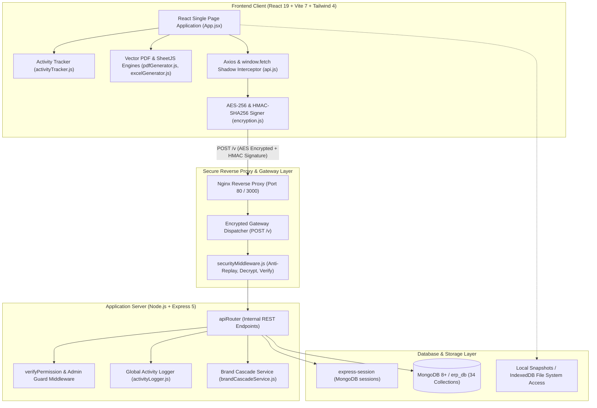
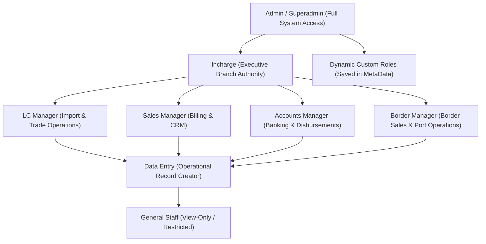
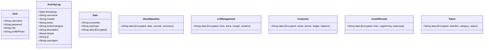
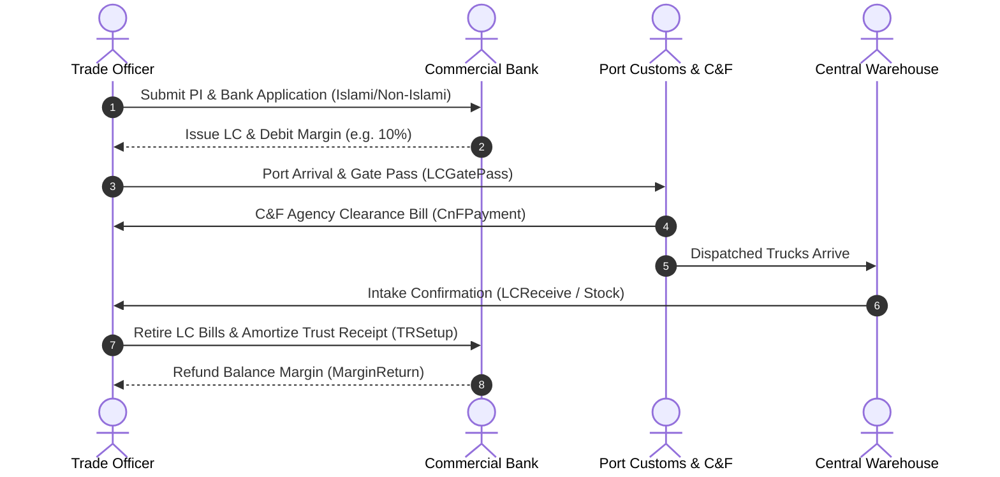
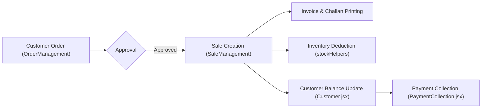
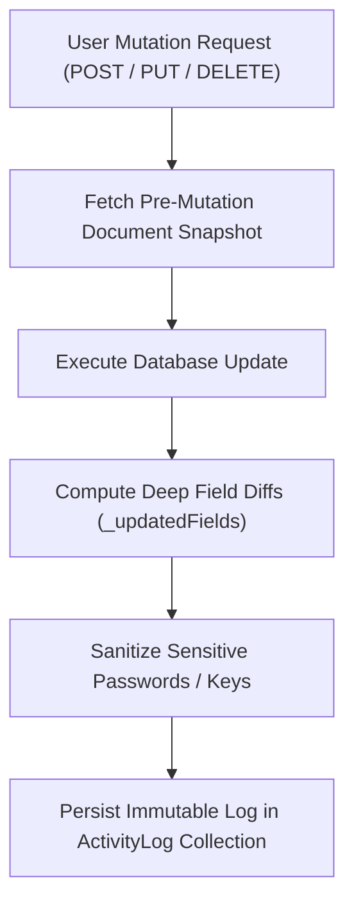

# ANI Enterprise ERP — System Architecture & Technical Documentation

**ANI Enterprise ERP** is a high-security, multi-tier Enterprise Resource Planning (ERP) platform designed for international commodity trading, cross-border commercial distribution, multi-warehouse inventory management, and landed cost accounting. The system powers end-to-end import lifecycles (Proforma Invoices, Letters of Credit, Marine Insurance, Customs C&F clearance, Port Gate Passes), inventory reconciliation (baseline snapshots, batch tracking, inter-warehouse transfers), wholesale commercial billing, customer financial ledgers, and forensic audit logging.

---

## Table of Contents

1. [System Architecture & Technology Stack](#1-system-architecture--technology-stack)
2. [End-to-End Encrypted Gateway (`/v`) & Data Security](#2-end-to-end-encrypted-gateway-v--data-security)
3. [Role-Based Access Control (RBAC) & Governance Matrix](#3-role-based-access-control-rbac--governance-matrix)
4. [Mongoose Data Model Registry (34 Models)](#4-mongoose-data-model-registry-34-models)
5. [Business Domain Modules & Operational Workflows](#5-business-domain-modules--operational-workflows)
   - [5.1 International Trade & Letter of Credit (LC) Lifecycle](#51-international-trade--letter-of-credit-lc-lifecycle)
   - [5.2 Inventory & Multi-Warehouse Operations](#52-inventory--multi-warehouse-operations)
   - [5.3 Procurement & Goods Receipt](#53-procurement--goods-receipt)
   - [5.4 Commercial Billing, Border Sales & Customer Ledgers](#54-commercial-billing-border-sales--customer-ledgers)
   - [5.5 Financials, Banking & Disbursements](#55-financials-banking--disbursements)
   - [5.6 Landed Cost of Goods Sold (COGS) & Profit/Loss Analytics](#56-landed-cost-of-goods-sold-cogs--profitloss-analytics)
   - [5.7 Support Ticketing & Data Amendment (Token System)](#57-support-ticketing--data-amendment-token-system)
   - [5.8 Backup & Disaster Recovery Engine](#58-backup--disaster-recovery-engine)
6. [Audit Logging & Forensics Tracking](#6-audit-logging--forensics-tracking)
7. [Document Generation Engines (PDF & Excel)](#7-document-generation-engines-pdf--excel)
8. [Comprehensive REST API Reference](#8-comprehensive-rest-api-reference)
9. [Deployment, Configuration & DevOps](#9-deployment-configuration--devops)

---

## 1. System Architecture & Technology Stack

ANI Enterprise ERP is architected around a 3-tier isolated service container model with client-side cryptography, shadow request routing, zero-knowledge storage, and client-side vector document rendering.



### Technology Matrix

| Component | Technology | Version | Purpose |
| :--- | :--- | :--- | :--- |
| **Frontend Framework** | React | 19.2.0 | Reactive component UI and real-time state orchestration |
| **Build & Tooling** | Vite | 7.2.4 | High-speed ESM bundler with legacy browser polyfills |
| **Styling** | Tailwind CSS | 4.1.18 | Utility-first CSS coupled with custom design token sheets |
| **Client Typography** | Custom Base64 Fonts | Embedded | Algerian, Cinzel, and Fraunces fonts loaded into virtual FS |
| **Vector PDF Engine** | jsPDF + AutoTable | 4.2.1 / 5.0.7 | Instant client-side document generation without SSR latency |
| **Spreadsheet Engine** | SheetJS (xlsx) | 0.18.5 | Client-side tabular Excel exports with formatting |
| **Client Encryption** | CryptoJS | 4.2.0 | AES-256 payload encryption & HMAC-SHA256 signatures |
| **Backend Framework** | Node.js + Express | 5.2.1 | Asynchronous HTTP REST API and internal gateway dispatcher |
| **Session Management** | express-session + connect-mongo | 1.19.0 / 6.0.0 | MongoDB-persisted HTTP-only sessions with Lax cookies |
| **Database & ODM** | MongoDB + Mongoose | 9.9.2 | 34 domain collections with encrypted-at-rest payloads |
| **Orchestration** | Docker Compose | 3.8 | Multi-container isolation (`erp_client`, `erp_server`, `erp_mongo`) |

---

## 2. End-to-End Encrypted Gateway (`/v`) & Data Security

### Enterprise Data Confidentiality
To eliminate network eavesdropping, MITM attacks, and inspection of sensitive commercial margins, rates, or supplier pricing, ANI Enterprise ERP replaces plain REST wire queries with an **End-to-End Encrypted Gateway (`/v`)**.

```
Standard Request:   Client  ── [GET /api/sales] (Plaintext) ─────────► Server
Secure ERP Gateway: Client  ── [POST /v] (AES-256 Ciphertext + HMAC) ──► Server
```

### Gateway Communication Pipeline
1. **Client Interception ([`client/src/utils/api.js`](file:///Users/mdriyadahmed/Documents/anienterprise-erp/client/src/utils/api.js))**:
   - Every `axios` and native `window.fetch()` call targeting `/api/*` is automatically intercepted (excluding FormData binary uploads and large backup files).
   - The original HTTP method (`m`), route path (`p`), and request body (`d`) are packed:
     ```javascript
     const gatewayPayload = {
         p: '/api/sales',
         m: 'POST',
         d: { customerId: 'CUST-001', items: [...], totalAmount: 450000 }
     };
     ```
2. **AES-256-CBC Encryption & HMAC-SHA256 Digital Signature**:
   - The `gatewayPayload` is encrypted using AES-256 with the shared `SECRET_KEY`.
   - A millisecond timestamp is captured (`X-Timestamp`).
   - A cryptographic HMAC-SHA256 digital signature (`X-Signature`) is generated over `${JSON.stringify(gatewayPayload)}|${timestamp}`.
   - The request is transformed to `POST /v` with headers `X-Timestamp`, `X-Signature`, and body `{ payload: "<ciphertext>" }`.
3. **Gateway Dispatching ([`server/src/index.js`](file:///Users/mdriyadahmed/Documents/anienterprise-erp/server/src/index.js) & [`server/src/middleware/securityMiddleware.js`](file:///Users/mdriyadahmed/Documents/anienterprise-erp/server/src/middleware/securityMiddleware.js))**:
   - `securityMiddleware` inspects `X-Timestamp` against `Date.now()`. Requests deviating by more than 5 minutes (300,000 ms) are rejected as replay attacks (legacy enterprise terminals such as BlackBerry 10 are granted lenient clock skew tolerances).
   - The signature is verified against the decrypted payload.
   - The gateway unpacks `p`, `m`, and `d`, rewrites `req.url`, `req.method`, and `req.body`, extracts query parameters into `req.query`, and dispatches the execution into `apiRouter`.
4. **Encrypted Response Interception**:
   - Standard route handlers call `res.json(data)`.
   - The `securityMiddleware` response proxy intercepts the outbound data and wraps it in `{ payload: encryptData(data), timestamp: Date.now() }`.
   - The client interceptor seamlessly decrypts the payload before passing it to React components.

### Zero-Knowledge Data Storage at Rest
In MongoDB, all business collections (such as `Sale`, `Customer`, `Stock`, `Product`, `LCManagement`, `CnFPayment`, `CostOfGoods`, `Purchase`) store their domain payload inside a single encrypted `data` field. Even if an unauthorized party gains access to a database backup or direct database shell, no transaction values, unit prices, customer contact lists, or financial data can be viewed without the application `SECRET_KEY`.

---

## 3. Role-Based Access Control (RBAC) & Governance Matrix

ANI Enterprise ERP implements an authorization matrix with multi-tiered operational workflows (1st Approve, 2nd Approve, Final Approve, and Edit Requests).

### Role Hierarchy



### Granular Permission Matrix

Permissions are evaluated dynamically on both frontend ([`permissionHelper.js`](file:///Users/mdriyadahmed/Documents/anienterprise-erp/client/src/utils/permissionHelper.js)) and backend (`verifyPermission` middleware). Every module supports 6 core flags:

1. **`view`**: Can access the module view and read records.
2. **`add`**: Can initiate and create new records.
3. **`edit`**: Can modify existing records.
4. **`delete`**: Can permanently delete records (restricted to Admin in critical modules).
5. **`special`**: Module-specific executive authority (e.g. Final Approval, Bill Entry, Password Reset).
6. **`showRate`**: Controls visibility of buying rates, dollar rates, and procurement margins on inventory views.

### Workflow Approval Actions

Critical financial and logistics modules implement tiered approval flows:

| Module | Special Permission Keys | Functionality |
| :--- | :--- | :--- |
| **Sales (`sales`, `borderSale`)** | `firstApprove`, `secondApprove`, `special`, `saleRequest`, `editRequest`, `approveEditRequest` | Multi-tier approval before stock deduction; edit lockdown requiring supervisor approval |
| **Order (`order`)** | `firstApprove`, `secondApprove`, `special`, `orderRequest`, `editRequest`, `approveEditRequest` | Pending order allocation that reserves saleable stock |
| **Purchase (`purchase`, `purchaseReceive`)** | `firstApprove`, `secondApprove`, `special`, `purchaseRequest`, `editRequest`, `approveEditRequest` | Multi-level procurement authorization & Goods Receipt Note (GRN) approval |
| **Disbursements (`cnfPayment`, `paymentCollection`, `payToCustomer`, `insurancePayment`)** | `firstApprove`, `secondApprove`, `special`, `paymentRequest`, `editRequest`, `approveEditRequest` | Segregation of duties between voucher preparation, account review, and cashier disbursement |
| **LC Operations (`lcManagement`)** | `special` (Add Bill), `specialEdit` (Edit Bill), `editLcReceive`, `editDollarRate`, `deleteAmendment` | Authorization for opening bank bills, adjusting exchange rates, and editing amendments |
| **Stock Transfer (`transfer`)** | `approve`, `showEntryBy` | Multi-warehouse transfer approval between source and destination branches |
| **HRMS / Employee (`employees`)** | `special` | Authority to force-reset user passwords |
| **Token (`token`)** | `special` | Authority to assign, manage, and close staff support and data correction tickets |

---

## 4. Mongoose Data Model Registry (34 Models)

All database entities are defined in [`server/src/models/`](file:///Users/mdriyadahmed/Documents/anienterprise-erp/server/src/models/).



### Complete Schema Catalog

| Category | Model File | Indexed / Key Fields | Encrypted Payload (`data`) Contents |
| :--- | :--- | :--- | :--- |
| **Core & Authentication** | [`User.js`](file:///Users/mdriyadahmed/Documents/anienterprise-erp/server/src/models/User.js) | `username` (unique), `role` | Password (SHA-256 hashed), Profile Photo (base64) |
| | [`Employee.js`](file:///Users/mdriyadahmed/Documents/anienterprise-erp/server/src/models/Employee.js) | `createdAt` | Full name, designation, department, contact, salary, role permissions |
| | [`MetaData.js`](file:///Users/mdriyadahmed/Documents/anienterprise-erp/server/src/models/MetaData.js) | `category` (indexed) | Dynamic custom roles, warehouse categories, product quality tags |
| | [`IpRecord.js`](file:///Users/mdriyadahmed/Documents/anienterprise-erp/server/src/models/IpRecord.js) | `createdAt` | Import Permit numbers, issue dates, validity periods, allowed commodities |
| | [`BackupSetting.js`](file:///Users/mdriyadahmed/Documents/anienterprise-erp/server/src/models/BackupSetting.js) | `createdAt` | Auto-backup schedules, local directory handles, retention policies |
| | [`Notification.js`](file:///Users/mdriyadahmed/Documents/anienterprise-erp/server/src/models/Notification.js) | `createdAt` | System alerts, stock threshold warnings, LC expiry dates, approval requests |
| | [`Token.js`](file:///Users/mdriyadahmed/Documents/anienterprise-erp/server/src/models/Token.js) | `createdAt` | Support tickets, data correction requests, requested changes, resolution status |
| **International Trade** | [`Importer.js`](file:///Users/mdriyadahmed/Documents/anienterprise-erp/server/src/models/Importer.js) | `createdAt` | Importer company name, BIN/IRC numbers, address, bank accounts |
| | [`Exporter.js`](file:///Users/mdriyadahmed/Documents/anienterprise-erp/server/src/models/Exporter.js) | `createdAt` | Foreign exporter company, country, contact details, payment terms |
| | [`Supplier.js`](file:///Users/mdriyadahmed/Documents/anienterprise-erp/server/src/models/Supplier.js) | `createdAt` | Domestic & international commodity suppliers, financial balances |
| | [`Port.js`](file:///Users/mdriyadahmed/Documents/anienterprise-erp/server/src/models/Port.js) | `createdAt` | Land customs stations & sea ports (Hili, Benapole, Chittagong, etc.) |
| | [`PI.js`](file:///Users/mdriyadahmed/Documents/anienterprise-erp/server/src/models/PI.js) | `createdAt` | Proforma Invoices, items, HS Codes, dollar values, revisions, terms |
| | [`PackingList.js`](file:///Users/mdriyadahmed/Documents/anienterprise-erp/server/src/models/PackingList.js) | `createdAt` | Shipping container numbers, truck breakdowns, gross & net metric weights |
| | [`TRSetup.js`](file:///Users/mdriyadahmed/Documents/anienterprise-erp/server/src/models/TRSetup.js) | `createdAt` | Trust Receipt loan setup, bank loan interest terms, tenure, repayment tracking |
| **Letter of Credit** | [`LCManagement.js`](file:///Users/mdriyadahmed/Documents/anienterprise-erp/server/src/models/LCManagement.js) | `createdAt` | LC number, opening bank, margin deposit (%), total USD, exchange rates, amendments |
| | [`LCGatePass.js`](file:///Users/mdriyadahmed/Documents/anienterprise-erp/server/src/models/LCGatePass.js) | `createdAt` | Port gate pass serial, truck numbers, driver information, dispatched weight |
| | [`LCExpense.js`](file:///Users/mdriyadahmed/Documents/anienterprise-erp/server/src/models/LCExpense.js) | `createdAt` | Auxiliary LC expenses: custom duties, port demurrage, transport, lab tests |
| | [`MarginReturn.js`](file:///Users/mdriyadahmed/Documents/anienterprise-erp/server/src/models/MarginReturn.js) | `createdAt` | Bank margin refunds returned upon LC bill retirement |
| **Third-Party Logistics** | [`CnF.js`](file:///Users/mdriyadahmed/Documents/anienterprise-erp/server/src/models/CnF.js) | `createdAt` | Clearing & Forwarding agency registry (Indian & Bangladeshi agencies) |
| | [`CnFPayment.js`](file:///Users/mdriyadahmed/Documents/anienterprise-erp/server/src/models/CnFPayment.js) | `createdAt` | C&F agency invoices, duty advance settlements, agency commission disbursements |
| | [`Insurance.js`](file:///Users/mdriyadahmed/Documents/anienterprise-erp/server/src/models/Insurance.js) | `createdAt` | Marine insurance companies, cover note numbers, insured commodity values |
| | [`InsurancePayment.js`](file:///Users/mdriyadahmed/Documents/anienterprise-erp/server/src/models/InsurancePayment.js) | `createdAt` | Marine insurance premium payment vouchers and bank cheques |
| **Inventory & Goods** | [`Product.js`](file:///Users/mdriyadahmed/Documents/anienterprise-erp/server/src/models/Product.js) | `createdAt` | Product catalog (Mosur Dal, Wheat, etc.), standard bag weights (kg), category |
| | [`Warehouse.js`](file:///Users/mdriyadahmed/Documents/anienterprise-erp/server/src/models/Warehouse.js) | `createdAt` | Physical warehouse depots (e.g. Hili, Bogura, Dinajpur), storage capacity |
| | [`Stock.js`](file:///Users/mdriyadahmed/Documents/anienterprise-erp/server/src/models/Stock.js) | `createdAt` | Physical stock arrivals from LCs, bag counts, truck allocations, net weights |
| | [`StockBaseline.js`](file:///Users/mdriyadahmed/Documents/anienterprise-erp/server/src/models/StockBaseline.js) | `createdAt` | Immutable inventory baseline snapshots (`snapshotRecords`, `summary`, `status`) |
| | [`Damage.js`](file:///Users/mdriyadahmed/Documents/anienterprise-erp/server/src/models/Damage.js) | `createdAt` | Quarantine stock damages, sieve dust (sweeped stock), transit losses |
| | [`Return.js`](file:///Users/mdriyadahmed/Documents/anienterprise-erp/server/src/models/Return.js) | `createdAt` | Customer RMA sales returns and supplier returns |
| **Sales & Procurement** | [`Sale.js`](file:///Users/mdriyadahmed/Documents/anienterprise-erp/server/src/models/Sale.js) | `invoiceNo` (unique, sparse), `saleType` | Invoice data: customer, multi-brand item lines, rates, discounts, payment status |
| | [`Purchase.js`](file:///Users/mdriyadahmed/Documents/anienterprise-erp/server/src/models/Purchase.js) | `createdAt` | Domestic purchase orders, supplier, ordered commodity quantity, agreed rate |
| | [`PurchaseReceive.js`](file:///Users/mdriyadahmed/Documents/anienterprise-erp/server/src/models/PurchaseReceive.js) | `createdAt` | Goods Receipt Notes (GRN) for purchases, warehouse intake verification |
| **Finance & Costing** | [`Customer.js`](file:///Users/mdriyadahmed/Documents/anienterprise-erp/server/src/models/Customer.js) | `createdAt` | Customer profile, trade license, credit limits, sales history, payment ledgers |
| | [`Bank.js`](file:///Users/mdriyadahmed/Documents/anienterprise-erp/server/src/models/Bank.js) | `createdAt` | Commercial bank accounts, routing numbers, account balances, transaction ledgers |
| | [`CostOfGoods.js`](file:///Users/mdriyadahmed/Documents/anienterprise-erp/server/src/models/CostOfGoods.js) | `createdAt` | Landed COGS analysis per LC: CIF base price + duties + transport + C&F |
| **Audit Forensics** | [`ActivityLog.js`](file:///Users/mdriyadahmed/Documents/anienterprise-erp/server/src/models/ActivityLog.js) | `timestamp`, `username`, `module`, `actionCategory` | Audit entries: user details, IP, User-Agent, action diffs, old vs new snapshots |

---

## 5. Business Domain Modules & Operational Workflows

### 5.1 International Trade & Letter of Credit (LC) Lifecycle

The international trade engine handles multi-month procurement cycles from contract signing to final margin reconciliation.



1. **Proforma Invoice (PI) & Import Permitting**:
   - Registered under [`PI.jsx`](file:///Users/mdriyadahmed/Documents/anienterprise-erp/client/src/components/modules/PI/PI.jsx) and [`IPManagement.jsx`](file:///Users/mdriyadahmed/Documents/anienterprise-erp/client/src/components/modules/IPManagement/IPManagement.jsx).
   - Generates official application letters to banks (supporting Islamic and Conventional banking letter formats via [`islbankApplicationGenerator.js`](file:///Users/mdriyadahmed/Documents/anienterprise-erp/client/src/utils/islbankApplicationGenerator.js) and [`nonIslamiBankApplicationGenerator.js`](file:///Users/mdriyadahmed/Documents/anienterprise-erp/client/src/utils/nonIslamiBankApplicationGenerator.js)).
2. **LC Management & Amendments ([`LCManagement.jsx`](file:///Users/mdriyadahmed/Documents/anienterprise-erp/client/src/components/modules/LCManagement/LCManagement.jsx))**:
   - Tracks opening dollar rates, bank margin deductions, product lists, freight charges, and shipment dates.
   - Comprehensive amendment timeline maintaining historical versions of quantities, rates, and dollar adjustments without corrupting earlier snapshots.
3. **Port Gate Pass & Warehouse Arrival**:
   - As trucks cross the border, Gate Passes are issued ([`LCGatePass.jsx`](file:///Users/mdriyadahmed/Documents/anienterprise-erp/client/src/components/modules/LCManagement/LCGatePass.jsx)).
   - Warehouse officers confirm physical truck arrival via [`LCReceive.jsx`](file:///Users/mdriyadahmed/Documents/anienterprise-erp/client/src/components/modules/LCReceive/LCReceive.jsx), creating corresponding `Stock` batches.
4. **LC Expenses & Margin Returns**:
   - All duty payments, clearing charges, lab test fees, and shipping demurrage are recorded in [`LCExpense.jsx`](file:///Users/mdriyadahmed/Documents/anienterprise-erp/client/src/components/modules/LCManagement/LCExpense.jsx).
   - When the LC is fully settled and retired, bank margin refunds are verified in [`MarginReturn.jsx`](file:///Users/mdriyadahmed/Documents/anienterprise-erp/client/src/components/modules/LCManagement/MarginReturn.jsx).

---

### 5.2 Inventory & Multi-Warehouse Operations

Inventory tracking is powered by [`stockHelpers.js`](file:///Users/mdriyadahmed/Documents/anienterprise-erp/client/src/utils/stockHelpers.js) which resolves physical stock across multiple locations.

#### The Stock Baseline Snapshot Architecture
To guarantee that historical inventory reports do not fluctuate when legacy records undergo corrections, the system utilizes **Stock Baselines (`StockBaseline`)**:
- An active baseline snapshot acts as an immutable physical inventory anchor.
- Real-time stock is calculated as:
  $$\text{Current Stock} = \text{Baseline Snapshot} + \Delta\text{Arrivals (LC + Purchases)} - \Delta\text{Dispatches (Sales + Orders + Damage)} \pm \Delta\text{Transfers}$$
- Historical baselines can be inspected, compared, or reverted at any time via `/api/stock-baseline`.

#### Real-Time Stock Calculation Engine (`calculateStockData`)
The inventory algorithm computes:
- **Opening Stock**: In-house stock at period start.
- **Period Arrivals**: Trucks received from LCs (`Stock`) and domestic purchases (`PurchaseReceive`).
- **Dispatches & Sales**: Quantities billed in `Sale` (General & Border sales).
- **Reserved Order Allocations**: Quantities booked in pending orders (`OrderManagement`), calculating net **Saleable Stock**:
  $$\text{Saleable Stock} = \max(0, \text{In-House Stock} - \text{Pending Order Stock})$$
- **Dust & Sweeped Grain**: Broken or sweeped grain generated during handling and sifting (`Damage`).
- **Damages & Quarantine**: Spoiled or water-damaged stock segregated from saleable inventory.
- **Inter-Warehouse Transfers**: Branch allocations moving goods between depots (e.g. Hili to Bogura) tracked in [`TransferManagement.jsx`](file:///Users/mdriyadahmed/Documents/anienterprise-erp/client/src/components/modules/Transfer/TransferManagement.jsx).

#### Brand Cascading Service ([`brandCascadeService.js`](file:///Users/mdriyadahmed/Documents/anienterprise-erp/server/src/services/brandCascadeService.js))
When commodity brand names are updated or normalized (e.g., correcting "V D" to "PUSKAR NANO"), standard database updates fail because payloads are encrypted. The Brand Cascade Service dynamically:
1. Loads all affected records across 10 collections: `stocks`, `warehouses`, `sales`, `costOfGoods`, `damages`, `purchases`, `purchaseReceives`, `customers`, and `stockBaselines`.
2. Decrypts every record payload in memory.
3. Updates matching brand references and recalculates dependent totals.
4. Re-encrypts and saves each document atomically.

---

### 5.3 Procurement & Goods Receipt

1. **Domestic & Local Purchases ([`PurchaseManagement.jsx`](file:///Users/mdriyadahmed/Documents/anienterprise-erp/client/src/components/modules/Purchase/PurchaseManagement.jsx))**:
   - Procurement orders placed with domestic suppliers.
   - Requires multi-level approval (`purchaseRequest` $\to$ `firstApprove` $\to$ `secondApprove` $\to$ `special`).
2. **Goods Receipt Notes / Purchase Receive ([`PurchaseReceiveManagement.jsx`](file:///Users/mdriyadahmed/Documents/anienterprise-erp/client/src/components/modules/PurchaseReceive/PurchaseReceiveManagement.jsx))**:
   - Verifies physical weight and bag count arriving at the warehouse.
   - Upon final approval, automatically feeds inventory into the warehouse stock balance and credits the supplier ledger.

---

### 5.4 Commercial Billing, Border Sales & Customer Ledgers



1. **Commercial Sales ([`SaleManagement.jsx`](file:///Users/mdriyadahmed/Documents/anienterprise-erp/client/src/components/modules/Sale/SaleManagement.jsx))**:
   - **General Sales**: Standard domestic wholesale distribution.
   - **Border Sales**: Sales executed directly at land customs borders (e.g. Hili Land Port) with separate logistics and C&F commission settlements.
   - **Orders**: Advance bookings that reserve stock without generating fiscal tax invoices until converted.
2. **Multi-Brand Batch Selection**:
   - Invoices support multi-brand and multi-rate line items on a single document.
   - Real-time stock validation prevents overselling beyond physical in-house availability.
3. **Customer Ledger Accounting ([`Customer.jsx`](file:///Users/mdriyadahmed/Documents/anienterprise-erp/client/src/components/modules/Customer/Customer.jsx))**:
   - Real-time balance computation (`computeCustomerBalance` in [`helpers.jsx`](file:///Users/mdriyadahmed/Documents/anienterprise-erp/client/src/utils/helpers.jsx)):
     $$\text{Balance} = \text{Opening Balance} + \sum\text{Invoices} - \sum\text{Discounts} - \sum\text{Payments Collected} + \sum\text{Refunds (Pay To Customer)} - \sum\text{Sales Returns}$$
   - Full transaction statement with drilldowns to individual invoice items, collection money receipts, and return credit notes.
4. **Sales Returns & RMA ([`ReturnProduct.jsx`](file:///Users/mdriyadahmed/Documents/anienterprise-erp/client/src/components/modules/ReturnProduct/ReturnProduct.jsx))**:
   - Restores returned commodities back into warehouse stock while crediting the customer's balance.

---

### 5.5 Financials, Banking & Disbursements

1. **Payment Collection ([`PaymentCollection.jsx`](file:///Users/mdriyadahmed/Documents/anienterprise-erp/client/src/components/modules/PaymentCollection/PaymentCollection.jsx))**:
   - Records customer payments via Cash, Bank Cheque, or Electronic Fund Transfer.
   - Automated generation of printable Money Receipts with embedded corporate typography.
2. **Pay To Customer ([`PayToCustomer.jsx`](file:///Users/mdriyadahmed/Documents/anienterprise-erp/client/src/components/modules/PayToCustomer/PayToCustomer.jsx))**:
   - Handles customer balance payouts, excess payment refunds, and financial adjustments with debit voucher generation.
3. **Bank Account Management ([`Bank.jsx`](file:///Users/mdriyadahmed/Documents/anienterprise-erp/client/src/components/modules/Bank/Bank.jsx))**:
   - Corporate bank ledger reconciliation, debit/credit logs, and cheque clearing schedules.
4. **Third-Party Agency Settlements**:
   - **C&F Agency Payments ([`CnFPayment.jsx`](file:///Users/mdriyadahmed/Documents/anienterprise-erp/client/src/components/modules/CnF/CnFPayment.jsx))**: Settles clearing agency bills, duty advances, and service charges.
   - **Marine Insurance Payments ([`InsurancePayment.jsx`](file:///Users/mdriyadahmed/Documents/anienterprise-erp/client/src/components/modules/Insurance/InsurancePayment.jsx))**: Settles marine policy cover note premiums.

---

### 5.6 Landed Cost of Goods Sold (COGS) & Profit/Loss Analytics

#### Landed Cost Engine ([`CostOfGoods.jsx`](file:///Users/mdriyadahmed/Documents/anienterprise-erp/client/src/components/modules/CostOfGoods/CostOfGoods.jsx))
Accurately calculating profit margins on imported agricultural commodities requires consolidating all auxiliary trade costs:
$$\text{Landed Cost / kg} = \frac{\text{LC Net Bill (BDT)} + \text{Customs Duty} + \text{C&F Charges} + \text{Port Expenses} + \text{Transport} + \text{Insurance}}{\text{Total Received Weight (kg)}}$$

The Cost of Goods module correlates every batch against its originating LC, tracking actual landed cost versus real-time market selling rates.

#### Interactive Profit & Loss Analytics ([`ProfitLoss.jsx`](file:///Users/mdriyadahmed/Documents/anienterprise-erp/client/src/components/modules/Sale/ProfitLoss.jsx))
- **Gross Profit**: Realized sales revenue minus landed COGS.
- **Net Operating Margin**: Gross profit adjusted for operating expenses, commissions, and transit losses.
- **Custom Interactive SVG 3D Donut Chart**: Visualizes cost distributions (procurement, duties, transport, agency commissions) with slice exploding and hover telemetry.

---

### 5.7 Support Ticketing & Data Amendment (Token System)

The **Token Management System** ([`Token.jsx`](file:///Users/mdriyadahmed/Documents/anienterprise-erp/client/src/components/modules/Token/Token.jsx)) provides an internal governance workflow for data amendments:
- When operational staff make an error in a locked invoice, stock entry, or voucher, they raise a formal Token.
- Categories: Entry Edit/Update, Data Correction, Delete Request, Invoice/Voucher Amendment, Access/Permission Request, Bug/Issue.
- Priority levels: Low, Medium, High, Urgent.
- Lifecycle: `Pending` $\to$ `In Progress` $\to$ `Resolved` / `Rejected`.
- Ensures complete segregation of duties and audit compliance without granting raw edit permissions to junior operators.

---

### 5.8 Backup & Disaster Recovery Engine

Implemented in [`BackupRestore.jsx`](file:///Users/mdriyadahmed/Documents/anienterprise-erp/client/src/components/modules/BackupRestore/BackupRestore.jsx) and backend backup endpoints:
1. **Full Database Snapshots**: Dumps all 34 collections into timestamped, structured JSON archives.
2. **Selective Module Backups**: Allows export and import of individual functional modules (e.g. Sales only, Customer only, or Inventory only).
3. **HTML5 File System Access API Integration**: Integrates directly with the user's local operating system using `showDirectoryPicker()` and IndexedDB handle persistence, enabling automated recurring local backups directly to a user-specified hard drive folder.
4. **Server-Side Backups**: Automated snapshots saved to `server/backups/` with one-click restore and download options.

---

## 6. Audit Logging & Forensics Tracking

ANI Enterprise ERP includes a tamper-resistant operational audit trail.



### Forensic Architecture ([`activityLogger.js`](file:///Users/mdriyadahmed/Documents/anienterprise-erp/server/src/services/activityLogger.js))
- **Deep Field Diffing**: On update requests (`PUT`/`PATCH`), the logger fetches the existing database document *before* modification, compares it against the new payload, and records exact changed fields in `_updatedFields`.
- **Payload Sanitization**: Strips passwords and cryptographic keys.
- **Telemetry Capture**: Records timestamp, `userId`, `username`, `userRole`, `displayName`, `module`, `actionCategory` (`MUTATION`, `APPROVAL`, `AUTH`, `UI_CLICK`, `SYSTEM`), human-readable `description`, client IP, and User-Agent.
- **Client Activity Tracking ([`activityTracker.js`](file:///Users/mdriyadahmed/Documents/anienterprise-erp/client/src/utils/activityTracker.js))**: Batches and sends UI events (report views, print events, PDF downloads, and modal interactions) to `/api/logs/client-action`.
- **Audit Console ([`LogManagement.jsx`](file:///Users/mdriyadahmed/Documents/anienterprise-erp/client/src/components/modules/Log/LogManagement.jsx))**: Provides administrators with an audit search terminal with filtering by user, date range, action category, and module.

---

## 7. Document Generation Engines (PDF & Excel)

All business documents and reports are generated entirely client-side using JavaScript vector rendering, eliminating server load and network transfer latency.

### 1. Vector PDF Engine ([`pdfGenerator.js`](file:///Users/mdriyadahmed/Documents/anienterprise-erp/client/src/utils/pdfGenerator.js) — 10,000+ Lines)
- **Embedded Typography**: High-resolution branding utilizing custom binary TrueType fonts (Algerian, Cinzel, and Fraunces) converted to Base64 strings and mounted directly into jsPDF virtual filesystem.
- **Document Portfolio**:
  - **Commercial Invoices & Delivery Challans**: Detailed multi-brand itemization, truck numbers, payment terms, and QR-ready layout.
  - **Money Receipts & Payment Vouchers**: Number-to-words currency formatting, cheque clearance details, authorized signatures.
  - **Port Gate Passes & Challans**: Transport specifications, gross/tare/net weights.
  - **Proforma Invoices (PI)**: Two distinct corporate design layouts ([`pipdfgenerator.js`](file:///Users/mdriyadahmed/Documents/anienterprise-erp/client/src/utils/pipdfgenerator.js) and [`pi2pdfgenerator.js`](file:///Users/mdriyadahmed/Documents/anienterprise-erp/client/src/utils/pi2pdfgenerator.js)) with automated currency conversion, HS Codes, and terms of delivery.
  - **Packing Lists (PL)**: Modern and classic designs ([`plpdfgenerator.js`](file:///Users/mdriyadahmed/Documents/anienterprise-erp/client/src/utils/plpdfgenerator.js) and [`pl2pdfgenerator.js`](file:///Users/mdriyadahmed/Documents/anienterprise-erp/client/src/utils/pl2pdfgenerator.js)) with gross/net metric weight matrices and container/truck allocations.
  - **Bank Letters & Applications**: Dedicated application generators for Islami Bank and Conventional banks ([`islbankApplicationGenerator.js`](file:///Users/mdriyadahmed/Documents/anienterprise-erp/client/src/utils/islbankApplicationGenerator.js), [`nonIslamiBankApplicationGenerator.js`](file:///Users/mdriyadahmed/Documents/anienterprise-erp/client/src/utils/nonIslamiBankApplicationGenerator.js), [`plNocApplicationPage.js`](file:///Users/mdriyadahmed/Documents/anienterprise-erp/client/src/utils/plNocApplicationPage.js), [`plTrTemplatePage.js`](file:///Users/mdriyadahmed/Documents/anienterprise-erp/client/src/utils/plTrTemplatePage.js)).
  - **Financial Statements**: Profit & Loss summaries, Customer Account Statements, Stock Ledgers, and COGS reports.

### 2. High-Fidelity Excel Engine ([`excelGenerator.js`](file:///Users/mdriyadahmed/Documents/anienterprise-erp/client/src/utils/excelGenerator.js) — 4,700+ Lines)
- Built on SheetJS (`xlsx`).
- Auto-formats columns, wraps text headers, applies financial number formatting, and calculates summary rows for all 30+ ERP modules.

---

## 8. Comprehensive REST API Reference

All requests pass through the Secure Encrypted Gateway (`POST /v`) or direct endpoints.

### Authentication & User Management
| Method | Endpoint | Authorization | Description |
| :--- | :--- | :--- | :--- |
| `POST` | `/api/auth/login` | Public | Authenticates user credentials and initializes MongoStore session |
| `GET` | `/api/auth/check` | Session | Validates active session and returns authenticated user permissions |
| `POST` | `/api/auth/logout` | Session | Destroys active session |
| `POST` | `/api/auth/change-password` | Session | Updates authenticated user password |
| `GET` | `/api/profile` | Session | Retrieves user profile metadata |
| `POST` | `/api/profile/photo` | Session | Uploads base64 encoded user avatar |

### HRMS & Employee Governance
| Method | Endpoint | Authorization | Description |
| :--- | :--- | :--- | :--- |
| `GET` | `/api/employees` | `employees:view` | Returns list of employees and permission sets |
| `POST` | `/api/employees` | `employees:add` | Registers new employee and system user account |
| `PUT` | `/api/employees/:id` | `employees:edit` | Modifies employee details and permissions matrix |
| `DELETE` | `/api/employees/:id` | `employees:delete` | Removes employee profile |
| `POST` | `/api/employees/:id/reset-password` | `employees:special` | Administrator password override |

### International Trade & Masters
| Method | Endpoint | Authorization | Description |
| :--- | :--- | :--- | :--- |
| `GET` / `POST` | `/api/importers` | `importerExporter:view / add` | Manage registered importer entities |
| `GET` / `POST` | `/api/exporters` | `importerExporter:view / add` | Manage international exporter entities |
| `GET` / `POST` | `/api/suppliers` | `importerExporter:view / add` | Manage domestic/international commodity suppliers |
| `GET` / `POST` | `/api/ports` | `port:view / add` | Manage land customs stations and sea ports |
| `GET` / `POST` | `/api/ip-records` | `ipManagement:view / add` | Manage Import Permit (IP) allocations |
| `GET` / `POST` | `/api/pi` | `pi:view / add` | Manage Proforma Invoices and revisions |
| `GET` / `POST` | `/api/packing-lists`| `packingList:view / add` | Manage customs packing lists |
| `GET` / `POST` | `/api/tr-setups` | `trSetup:view / add` | Manage bank Trust Receipt (TR) loan agreements |

### Letter of Credit (LC) Operations
| Method | Endpoint | Authorization | Description |
| :--- | :--- | :--- | :--- |
| `GET` / `POST` | `/api/lc-management` | `lcManagement:view / add` | Manage LC lifecycles, margins, and dollar values |
| `PUT` | `/api/lc-management/:id`| `lcManagement:edit` | Update LC or register new amendments |
| `GET` / `POST` | `/api/lc-gp` | `lcGp:view / add` | Manage LC Port Gate Passes |
| `GET` / `POST` | `/api/lc-expenses` | `lcExpense:view / add` | Record and disburse auxiliary LC expenses |
| `GET` / `POST` | `/api/margin-returns`| `marginReturn:view / add` | Record bank margin refunds |

### Inventory, Stock & Warehousing
| Method | Endpoint | Authorization | Description |
| :--- | :--- | :--- | :--- |
| `GET` / `POST` | `/api/products` | `product:view / add` | Manage master product catalog and packet sizes |
| `GET` / `POST` | `/api/warehouses` | `warehouse:view / add` | Manage storage depot locations |
| `GET` / `POST` | `/api/stock` | `stock:view / add` | Manage physical stock intake batches |
| `POST` | `/api/stock-baseline` | Admin / Incharge | Record new immutable inventory baseline snapshot |
| `GET` | `/api/stock-baseline/active` | `stock:view` | Fetch current active inventory baseline |
| `GET` | `/api/stock-baseline/history`| `stock:view` | View historical inventory baseline snapshots |
| `POST` | `/api/stock-baseline/:id/activate` | Admin | Set active baseline snapshot anchor |
| `GET` / `POST` | `/api/damages` | `warehouse:view / add` | Record quarantine damage and sweeped grain |

### Commercial Sales, Orders & Procurement
| Method | Endpoint | Authorization | Description |
| :--- | :--- | :--- | :--- |
| `GET` / `POST` | `/api/sales` | `sales:view / add` | Create and query General and Border sales |
| `PUT` | `/api/sales/:id` | `sales:edit` | Update sale or process approval stages |
| `GET` / `POST` | `/api/purchases` | `purchase:view / add` | Manage domestic purchase orders |
| `GET` / `POST` | `/api/purchase-receives` | `purchaseReceive:view / add` | Goods Receipt Notes (GRN) verification |
| `GET` / `POST` | `/api/returns` | `returnProduct:view / add` | Process customer RMA product returns |

### Financials, Banking & Costing
| Method | Endpoint | Authorization | Description |
| :--- | :--- | :--- | :--- |
| `GET` / `POST` | `/api/customers` | `customer:view / add` | Manage customer profiles and ledgers |
| `GET` / `POST` | `/api/banks` | `bank:view / add` | Manage commercial bank accounts and ledgers |
| `GET` / `POST` | `/api/cnfs` | `cnf:view / add` | Manage C&F clearing agency directory |
| `GET` / `POST` | `/api/cnf-payments` | `cnfPayment:view / add` | Manage C&F payment disbursements |
| `GET` / `POST` | `/api/insurance` | `insurance:view / add` | Manage marine insurance policy registry |
| `GET` / `POST` | `/api/insurance-payments`| `insurancePayment:view / add` | Manage insurance premium payments |
| `GET` / `POST` | `/api/cost-of-goods` | `costOfGoods:view / add` | Calculate landed COGS per LC |

### Support Ticketing (Token) & System Auditing
| Method | Endpoint | Authorization | Description |
| :--- | :--- | :--- | :--- |
| `GET` / `POST` | `/api/tokens` | `token:view / add` | Create and query support and data edit tickets |
| `PUT` | `/api/tokens/:id` | `token:edit / special` | Update ticket status (In Progress, Resolved, Rejected) |
| `GET` | `/api/logs` | Admin Only | Query paginated forensic activity logs |
| `GET` | `/api/logs/stats` | Admin Only | Activity metrics, user operations, and failure counts |
| `POST` | `/api/logs/client-action` | Session | Ingest client UI telemetry (prints, clicks, views) |
| `GET` | `/api/backup-database` | Admin Only | Download full system database snapshot JSON |
| `POST` | `/api/restore-database-upload` | Admin Only | Restore database from uploaded JSON snapshot |

---

## 9. Deployment, Configuration & DevOps

### 1. Docker Compose Production Deployment
The application is pre-configured for containerized deployment across three isolated Docker services:

```yaml
version: '3.8'

services:
  server:
    build: ./server
    container_name: erp_server
    ports:
      - "5000:5000"
    environment:
      - PORT=5000
      - MONGODB_URI=mongodb://mongo:27017/erp_db
      - SECRET_KEY=your_production_secret_key
      - SESSION_SECRET=your_production_session_secret
    depends_on:
      - mongo
    volumes:
      - ./server:/app
      - /app/node_modules

  client:
    build: ./client
    container_name: erp_client
    ports:
      - "3000:80"
    depends_on:
      - server

  mongo:
    image: mongo:latest
    container_name: erp_mongo
    ports:
      - "27017:27017"
    volumes:
      - mongo-data:/data/db

volumes:
  mongo-data:
```

#### Running the Application
```bash
# Start all services with automated build
npm run run:full

# Or via Docker Compose directly:
docker-compose up -d --build
```
- **Web UI**: `http://localhost:3000`
- **Backend API**: `http://localhost:5000`
- **Health Check**: `http://localhost:5000/health`

---

### 2. Manual Development Setup (Without Docker)

#### Prerequisites
- Node.js 18+ (Node 20+ recommended)
- MongoDB instance running on `mongodb://localhost:27017`

#### Server Setup
```bash
cd server
npm install
npm run dev
```
*Server runs on port 5000 with nodemon live reload.*

#### Client Setup
```bash
cd client
npm install
npm run dev
```
*Client runs on port 3000 with Vite HMR.*

---

### 3. Environment Variables Reference

#### Server (`server/.env`)
| Variable | Default Value | Description |
| :--- | :--- | :--- |
| `PORT` | `5000` | Port on which the Express server listens |
| `MONGODB_URI` | `mongodb://localhost:27017/erp_db` | MongoDB connection connection string |
| `SECRET_KEY` | `ani1820` | Shared AES-256 and HMAC-SHA256 encryption key |
| `SESSION_SECRET` | `ani_enterprise_erp_secret_key` | Express session cookie signing secret |

---

### 4. Build Optimizations & Legacy Browser Support

#### Vite Build Configuration ([`client/vite.config.js`](file:///Users/mdriyadahmed/Documents/anienterprise-erp/client/vite.config.js))
- **Legacy Terminal Compatibility**: Utilizes `@vitejs/plugin-legacy` targeting `chrome 30`, `safari 7`, `ios 7`, and `bb 10` (BlackBerry 10 OS) to support rugged warehouse terminals and legacy enterprise handhelds.
- **Rollup Code Splitting**: Bundles vendor dependencies into `vendor` (`react`, `react-dom`, `axios`, `crypto-js`) and `export` (`xlsx`, `jspdf`, `jspdf-autotable`).
- **Asset Obfuscation**: Production asset outputs are hashed to `s/[hash].js` and `s/[hash].css`.

#### Nginx Production Gateway ([`client/nginx.conf`](file:///Users/mdriyadahmed/Documents/anienterprise-erp/client/nginx.conf))
- Single Page Application fallback: `try_files $uri $uri/ /index.html;`
- Upstream reverse proxying of `/api/` and the `/v` encrypted gateway to `http://server:5000`.
- Max upload limit configured to `100M` for database restore files.

---

### 5. Automated Seeding & Maintenance
- **Default Admin Account**: Upon first boot, if no accounts exist in `User`, the system seeds:
  - **Username**: `admin`
  - **Password**: `admin123`
  - **Role**: `admin`
- **Startup Stock Sanitization**: `cleanupZeroStockBaselineItems()` scans `StockBaseline` on server launch to filter ghost zero-quantity entries, normalize brand naming variants, and ensure accurate valuation totals.

---

*Documentation maintained by ANI Enterprise Engineering Team.*
